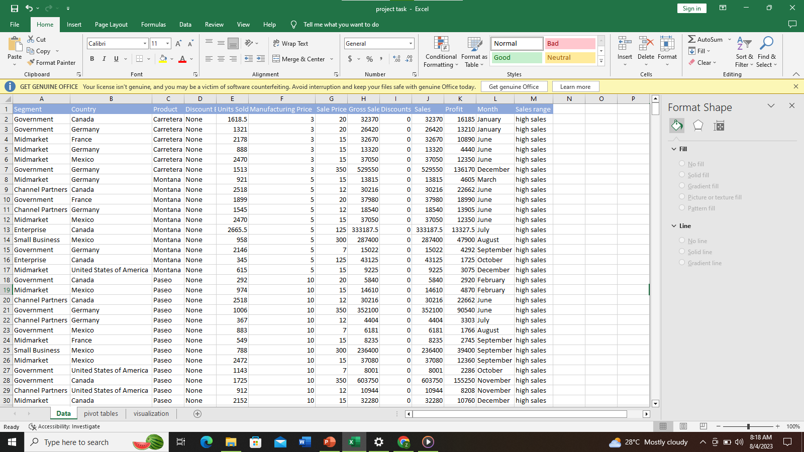
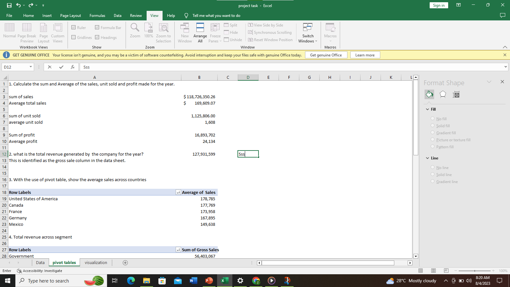
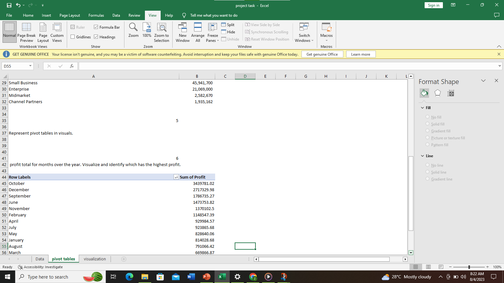
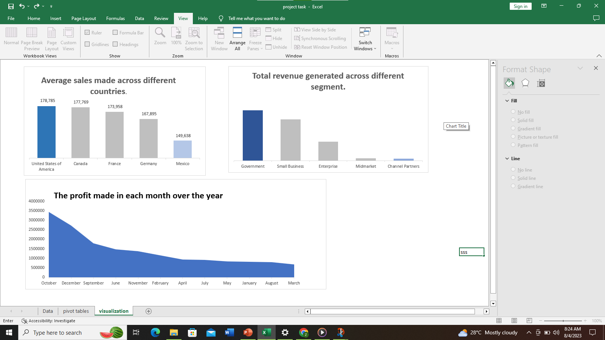

# PROJECT-TASK

**#INTRODUCTION**

After the completion of the use of Excel for data analysis, the instructor gave a task to test the understanding of what has been learned so far. She provided us with a sales data of a US superstore. Participants are required to come up with questions on their own and also provide solutions to the problem created.

Data has been cleaned. So, the next thing is to dive into action

**#TASK**

1.	Calculate the sum and Average of the sales, units sold and profit made for the year.
2.	what is the total revenue generated by the company for the year?
3.	With the use of a pivot table, show the average sales across countries.
4.	Total revenue across segments.
5.	Represent pivot tables in visuals.
6.	Total profit made in each month across the year.

	Below is an image of the data provided

I proceeded with finding solutions to the questions. The first and second question was answered using the “SUM” and “AVERAGE” function.

The third and fourth questions is solved using the “INSERT” icon to create a pivot table, inserting variables in their right position and arriving at the answers in the provided image below.

The fifth question requires the use of visual to represent the answers gotten from the pivot tables. As shown below.

**#CONCLUSION**
This brings us to the end of the task and excel class in general. 

